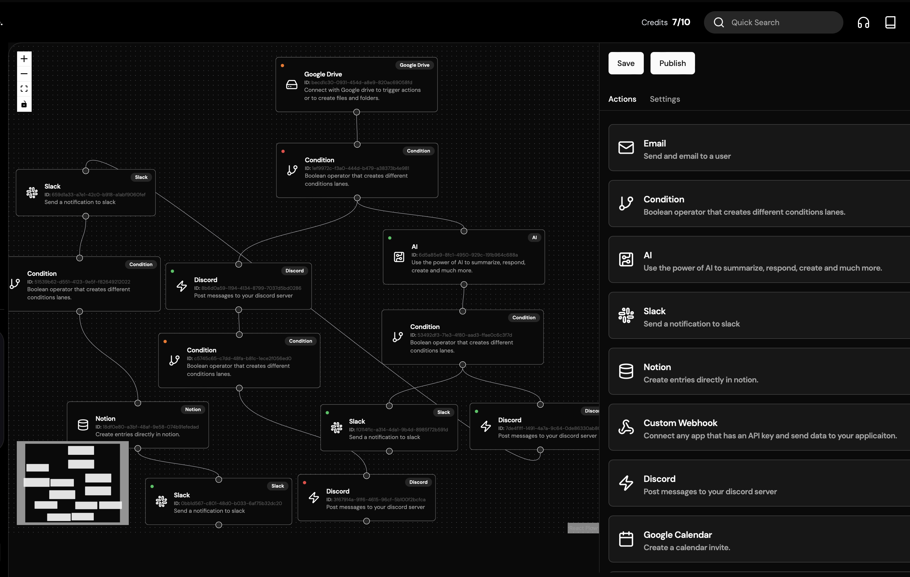

&#xa0;

  

<a href="https://jj-zapflow.vercel.app/">Demo</a>

# SaaS Automation Builder

## Overview

ZapFlow is a SaaS Automation Builder, a powerful and versatile platform designed to automate and streamline your business processes. Built from the ground up without relying on integration libraries, this builder offers a seamless and customizable experience for creating automation flows. Whether you are a small business or a large enterprise, our builder has the features you need to connect various services and automate your workflows efficiently.

## Features

### User Authentication & Management
- **Clerk Authentication:** Secure and efficient user authentication.
- **Neon Tech:** Cutting-edge technology stack for robust performance.

### Integrations
- **Google Drive:** Connect users' Google Drive to the app and watch for changes.
- **Slack:** Send notifications and custom messages to users' Slack channels.
- **Discord:** Notify and send custom messages to users' Discord servers.
- **Notion:** Create entries in users' Notion databases.

### Payments
- **Stripe Integration:** Handle month-to-month subscriptions and payments based on credits consumed.

### User Interface
- **Beautiful Redesigned Node Interface:** Intuitive and aesthetically pleasing interface for creating automation flows.
- **Drag and Drop Node Builder:** Easily create and manage nodes with a drag-and-drop interface.
- **Mini Map:** View all workflow nodes on a mini map for better navigation.
- **Infinite Canvas:** An expandable workspace to accommodate complex workflows.
- **Expandable Sidebar with Drag Feature:** Customize your workspace with a draggable sidebar.
- **Aceternity UI:** Sleek and modern user interface design.
- **Light & Dark Mode:** Switch between light and dark themes based on your preference.
- **Functioning Beautiful Landing Page:** An attractive and functional landing page to showcase your automations.

### Deployment & Hosting
- **Ngrok:** Secure tunnel for localhost deployment.
- **Next.js 14:** Latest version for optimized and scalable web applications.
- **Bun:** Fast and efficient JavaScript runtime for server-side operations.

## How It Works

1. **Connect Services:** Start by connecting your preferred services such as Google Drive, Slack, Discord, and Notion.
2. **Create Automations:** Use the drag-and-drop node builder to create a sequence of actions that fire after a trigger event.
3. **Monitor Changes:** Watch for changes in connected services and automate responses accordingly.
4. **Notifications & Messages:** Send notifications and custom messages via Slack and Discord.
5. **Manage Payments:** Utilize Stripe for managing subscriptions and handling payments based on credits consumed.
6. **Customize Interface:** Personalize your workflow with an expandable sidebar, infinite canvas, and light/dark mode.

## Conclusion

ZapFlow is a SaaS Automation Builder is your go-to platform for creating and managing powerful automation workflows. With its robust integrations, user-friendly interface, and customizable features, it caters to the needs of businesses looking to streamline their operations and enhance productivity. Start building your automation flows today and experience the efficiency of seamless integration and automation.

© 2024 Jeff Jiang. All rights reserved.
